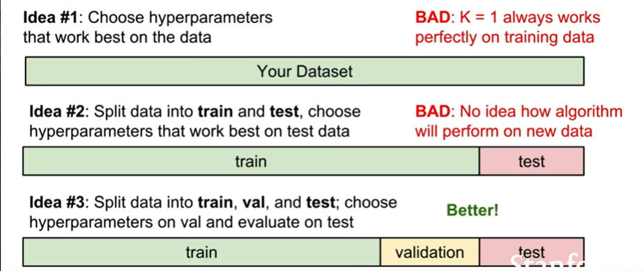

# CS231n-Lecture 2 | Image Classification
assignment에 주로 사용되는 lib는 numpy + python

## The Image Classification Task
- System receives image data - select from fixed category label. actually really hard problem! 컴퓨터는 단순한 그림이 아닌 숫자들의 집합으로서 관측한다.


### semantic gap
조금의 픽셀 변화가 엄청난 숫자의 변화를 만든다. e.g. tort camera angle.

### Challenges
- illumination, deformation, Occlusion(숨어있는 경우)... Can we handle these problems simultaneously? 

Problems should be...

```python
def classify_image(image):
    #code
    return class_label
```

Is there any strict algorithm? No! there are no explicit algorithm.

### E.G.
- Find edges -> Find corners... not scaleable approach.

### Data - Driven Approach
1. Collect a dataset of images& labels.
2. Train them (Train Model)
3. Evaluate the classifier

### So skeleton should be...

```python
def train(images,labels):
    #learn something
    return model

def predict(model, test_images):
    #Predict labels
    return predict_labels
```

## K-Nearest Neighbot

### Nearest Neighbor

```python
def train(images,labels):
    #Memorize all data and labels
    return model

def predict(model, test_images):
    #Predict the Label of the most similar training image
    return predict_labels
```

#### Example Dataset: CIFAR10


### Problem : How do we compare them?
## Nearest Neighbor Classifier

### Distance Metric
- L1 Distance: 
    $$
        d_1(I_1,I_2) = \sum_p |I_1^p - I_2^p|
    $$
    - concrete ways to calculate difference between images
    - for each test image : Find closest train image, then find the closest image which is closest to test image.
    - bad, it is fast for training, but bad for prediction(O(N))
    - Noisy...
    - K Nearest Neighbor
      - Instead of copying label from nearest neighbor, take majority vote for k nearest neighbor.
      - 이 부분도 마찬가지
    - 
- L2(Euclidean) distance
    $$
        d_1(I_1,I_2) = \sqrt{\sum_p{(I_1^p - I_2^p)^2}}
    $$
- Difference between two metric
  - If we rotate -> it would change its length 
  - if vector have some important metric - L1 fit
  - if the metric is just general -> L2 is fit
  - 이 부분 확실하게 해결 안 됨.
  - For example, if we intend to calculate categorical data....

### problem - is there any best k or metric?
- Depends on problem.
- Idea #1 fit on training idea?
  - terrible! our goal is to solve unseen data
- Idea #2 : split data into train and test.
  - Terrible also! : it would overfit to test set - is it can represent unseen data?
- Idea #3 Split data into train, val and test.
- 
- Idea #4 Cross-Validation
  - not used in deep learning frequently - training is expensive... althohugh most valid.
  - 


## Linear Classifier


```python
def syntaxHighlight():
    haroo = "press"
    return haroo
```
