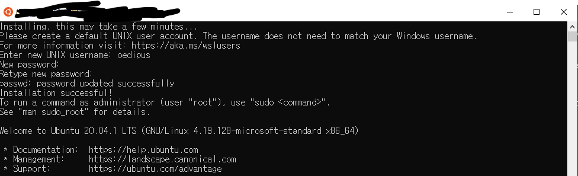
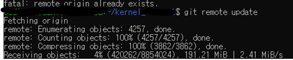

## Environment

In order to do so, I selected WSL2 rather than VMware-sort of virtual machine.

reaons are:
1. Authority : It is microsoft-proofed program
2. Share filesystem : I can see its files from my windows-vscode! 
3. Swag

So I uninstalled vmware, then installed WSL2 with following microsoft's guideline

[WSL_2_Installation](https://docs.microsoft.com/ko-kr/windows/wsl/install-win10)

Although it required several re-boot, but it caused no anxiety since its process is really simple. but shortlyafter I installed ubuntu...



OMG!!!! It didn't support GUI! 

But it was ok.... Since What I really want is just compile the kernel.

So the next step should be download kernel version

My aim is to download 5.8y version by using git.

First, we have to set our origin as linux kernel repository, 
```
$ git remote add origin https://git.kernel.org/pub/scm/linux/kernel/git/stable/linux.git
```
Then, in order to access remote branch...
```
$ git remote update
```

it is quite confusing, since is takes a huge amount of space... Is it really different from git clone?



Finally, change our branch to intended version
```
# to see branch lists
$ git branch -a
# change branch to intended version
$ git checkout origin/linux-5.8.y 
```

Compile is next step...

## Questions

1. what is defconfig?
   1. we make make defconfig in linux file

2. what is 