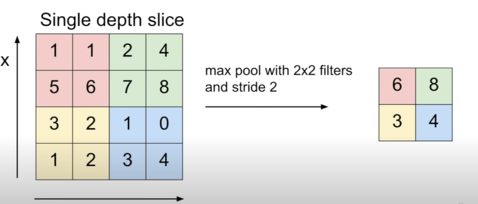

## Convolution Layer

- It preserve spatial structure
- always extend the full depth of the input volume
- 
- In the example, border will be truncated by 4, since its filter size is 5x5x3
- the output is called activation filter (i.e. each filter produces activation layer)
- There could be multiple filters. Then its output dimention would be #filtersx28x28 since we slide the filter
- If we take the stride(interval of the filter slide) 2, it would be 3*3
- So in general, Output dim would be (N-F)/stride + 1
- 
- if we want to make dimension fit, we put zero pad at the border(so we get integer dim) 
- in neuron view, 5x5 filter -> 5x5 receptive field for each neuron
- 5 filter -> 5 neurons looking at the same region

## Pooing layer

- Downsamples the activation layer
- e.g. MAX POOLING
- 
- it has no overlap
- why MAX? not average?
  - in order to get most impressive feature
- 