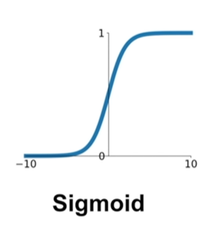

How we train Neural Network?

1. How do we setup at the beginning?
2. Training dynamics
3. Evaluation

Part 1

## Activation Functions

- Sigmoid function
$$ \sigma(x) = {{1}\over{1+e^{-x}}} $$
    
  - how does gradient look like?

## Data Preprocessing

## Weight Initalization

## Batch Normalization

## Babysitting the Learning Process

## Hyperparameter Optimization