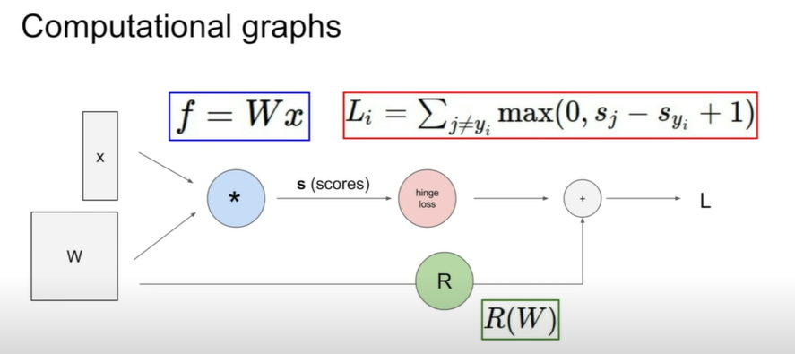
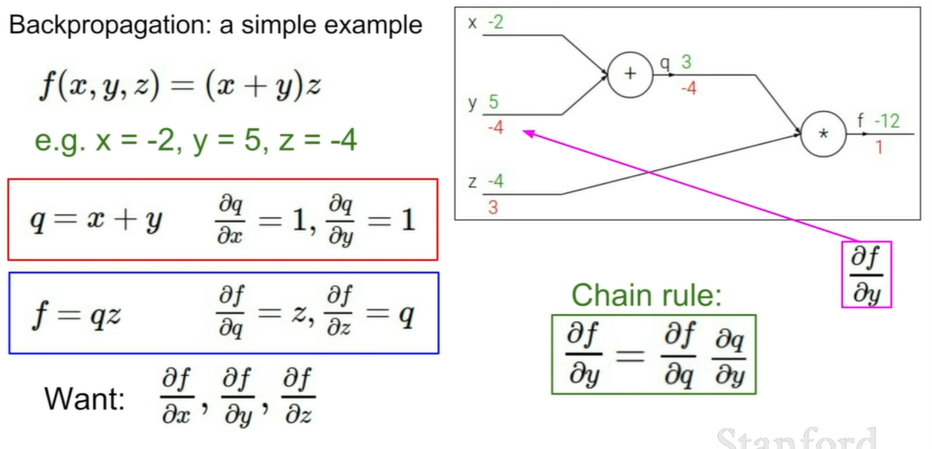

# Introduction to Neural Networks

## We want $\nabla_W L$!!

## Im this lecture, we learn how to drive analytic gradient

## How does backpropagation works?
- Simple partial derivative + Chain rule
- [local gradient] x [upstrean gradient]

